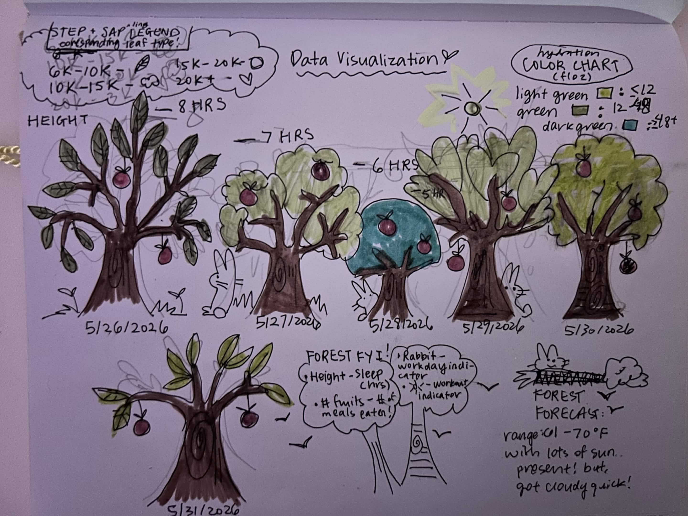

# Setup

```{r}
#| label: packing
#| message: false
library(tidyverse)
library(here)
library(janitor)
library(readxl)
```


```{r}
#| message: false
#| include: false
library(scales)
```

```{r}
#| label: kelp package
kelp <- read_csv(here("data", "temp-kelp (1).csv"))
head(kelp)
```

# Problem 1

1a. 

The appropriate tests to determine the strength of the relationship between temperature and giant kelp frond elongation rate are the correlation analysis and linear regression tests. 

Correlation analysis test would be useful because it would show the strength and direction of the linear relationship between the two variables using the r coefficient and doesn't designate either variable as cause-or-effect. 

Linear regression uses mathematical representation of the relationship and analyzes it through a cause-and-effect modeling of specific temperature and its corresponding elongation rate of kelp. 

The tests are different because correlation analysis merely analyzes the strength/direction of the relationship without merely designating a causation in the relationship's variables, while linear regression treats the variables as a cause-and-effect. 

1b. 

```{r}
#| label: visualizing

ggplot(kelp, aes(x = temp_c, y = kelp_elong)) +
  geom_point(color = "salmon", size = 2) + 
  labs(x = "Temperature (C°)", 
       y = "Giant Kelp Frond Elongation Rate(cm day-1)", 
       title = "Relationship between temperature and growth rate of giant kelp fronds") + 
theme_replace()
```

1c. 

Assumption Checks:
```{r}
#| label: checking
kelp_checking <- lm(kelp_elong ~ temp_c, data = kelp)
par(mfrow = c(2, 2))
plot(kelp_checking)
```

Test Running:

Linear Regression Test:
```{r}
#| label: linear
summary(kelp_checking)
```

The assumptions I checked for were linearity, normal distribution, homeoscadacity, and influential points. I checked using diagnostic plots from the linear regression graphs. From the diagnostic plots, the assumptions seem generally satisfied, as the residuals are not following any sort of extreme pattern, the qqline shows a relative normal distribution, and the Cook's distance values were low in the RVL plots. 

Correlation Test:
```{r}
#| label: corr
cor.test(kelp$temp_c, kelp$kelp_elong)
```

A Pearson's correlation test showed a strong negative relationship between temperature and growth rate of kelp fronds (r = -0.6877, p-value = 1.366e-05), suggesting that as ocean temperature increases, elongation rate decreases. 

1d. 

To evaluate the relationship between temperature and kelp growth rate, I used the summary function to construct linear regression model and the Pearson correlation for my correlation test. Pearson correlation measures the direction and strength of the relationship between temperature and elongation, while linear regression analyzed the predictability of temperature on growth rate.

From my test results, it appears that there is a negative association between temperature and kelp elongation rate, suggesting that kelp grows slower under hotter ocean temperatures (Pearson correlation: r = -0.6877, p-value = 1.366e-05, linear regression: beta = -0.432, r-squared = 0.473, p = 1.366e-05)

1e. 

Our results suggest rising ocean temperatures negatively impact giant kelp frond growth rates, which could negatively influence surrounding ecosystems and affect biodiversity. It raises a biological and ecological concern for surrounding members in aquatic ecosystems that coexist around these kelp populations as kelp is an abundant autotroph, habitat, and food source for many marine organisms. 

Reduced growth would massively influence other members in the associated food chains/ecosystems and could deteriorate ecosystem functioning. These statistical findings call for an action to further monitor on kelp communities, as continuing increases in ocean temperatures may pose significant danger and risk to ecosystems, climate, nature, and our environment. 

These concerns raised from these statistical findings should not be taken lightly and should be used towards greater ecological preservation efforts and continued environmental management. 

1f. 

```{r}
#| label: repeating

cor.test(kelp$temp_c, kelp$kelp_elong)

summary(kelp_checking)
```

# Problem 2

2a. 

```{r}
personal_data <- read_csv("homework 3 personal data project - Sheet1.csv")
# defining csv file into R 
personal_data$Date
```

Hydration + Daily Steps: 

```{r}
ggplot(personal_data,
       aes(y = hydration,
           x = steps,
           color = Date)) +
  geom_point(size = 4) +
  geom_smooth(method = "lm",
              se = FALSE,
              color = "red",
              linewidth = 2) +
  labs(
    y = "Hydration (fl oz)",
    x = "Steps (per day)",
    color = "Date",
    title = "The Relationship Between Hydration and Steps Daily",
    subtitle = "Most recent observations from 5/26 - 5/31"
  ) +
  scale_y_continuous(labels = scales::comma) +
  theme_minimal()
```

Workday vs. Sleep
```{r}
ggplot(personal_data, aes(x = workday, y = Sleep_hrs, fill = workday, color = workday)) +
  geom_boxplot(show.legend = FALSE, alpha = 0.5) +
  geom_jitter(width = 0.1, alpha = 0.8, size = 2) + 
  geom_text(
    aes(label = Date),
    position = position_jitter(width = 0.1),
    vjust = -0.8,
    size = 3
  ) +
  labs(
    x = "Workday",
    y = "Sleep Duration (hours)", 
    title = "Sleep Duration on Workdays and Non-Workdays",
    subtitle = "Most recent observations from 5/26 - 5/31") 
```

2b.

Lineplot:
Figure 1. Daily step count and daily hydration levels (in fluid ounces) from 5/26/2026-5/31/2026. Each point and color represents a different, individual day of observation. The red line in the graph shows the general trend of the relationship between hydration and daily stepcount. The positive trend observed in this graph suggests that greater step counts are generally associated with higher levels of hydration. 

Boxplot:
Figure 1. Nightly sleep duration (in hours) on workdays and non-workdays from 5/26/2026-5/31/2026. Each point represents an individual observation, with yes points indicated with blue and no points indicated in red. The boxplots summarize the overall distribution of sleep duration depending on whether there was a workday or not. Sleep duration tended to be generally higher if the day was not a work day. 


# Problem 3

3a. 

I think an affective visualization that could be useful for my project would be in the form of a tree, where the more sleep there is, the taller the tree is. The color of the leaves in the tree could represent hydration intake, with light to dark green showing smaller to larger hydration levels. The amount of leaves could represent how many steps there are. Meals eaten could be the number of fruit present. Workout days could be represented by the presence of a sun. Workdays could be represented with the presence of animals.

3b. 
```{r, echo=FALSE, out.width="80%",fig.align="center"}
#| echo: false
#| message: false

```
3c. 
```{r, echo=FALSE, out.width="80%",fig.align="center"}
#| echo: false
#| message: false

```

# Problem 4